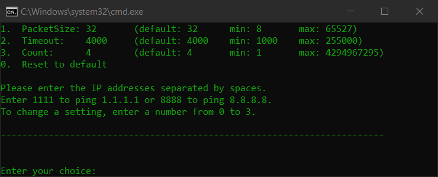

# EasyPingTool.BAT

## Description

Effortlessly initiate ping commands to multiple IP addresses via individual command prompt windows, while adjusting ping parameters as needed.

## Features

- **Adjustable Ping Parameters**: Customize the packet size, timeout, and number of echo requests to tailor the ping to specific network needs.
- **Display Current Settings**: Quickly view the current configuration with default, minimum, and maximum values to understand the operational parameter range.
- **Interactive User Input**: The script interacts with the user through a command-line interface (CLI), allowing for real-time changes to settings and immediate execution of ping commands.
- **Predefined Quick Pings**: Includes shortcut commands to ping well-known public DNS servers like `1.1.1.1` and `8.8.8.8` for quick connectivity checks.
- **Dynamic Parameter Reset**: Users can easily reset all settings to their default values with a single command, facilitating quick reconfiguration.

## Simple Instructions

1. Run the EasyPingTool.BAT script.
2. Enter IP addresses separated by spaces.
3. Press Enter.

## Detailed Instructions

1. **Launch the Script**: Run `EasyPingTool.BAT`.
2. **View Current Settings**: Upon launch, the script displays the current settings for packet size, timeout, and count of echo requests, including their default, minimum, and maximum values.
3. **Modify Settings**: Enter `1`, `2`, or `3` to change the packet size, timeout, or count respectively. Follow the prompts to input new values or reset to defaults.
4. **Execute Pings**: Enter IP addresses separated by spaces to start pinging. Special shortcuts `1111` and `8888` can be used to quickly ping `1.1.1.1` and `8.8.8.8`.
5. **Reset to Default**: Enter `0` to reset all parameters to their default values.

## System Requirements

EasyPingTool.BAT is compatible with any Windows environment that supports batch scripting.

## Additional Notes

- Ensure that your command prompt window has appropriate permissions to execute ping commands, especially in environments with restricted policies.
- While the script provides flexibility in network diagnostics, it should be used responsibly to avoid any network disruption or unintended denial of service due to excessive pinging.

## Licensing

This project is distributed under a dual license: [MIT License](./LICENSE_MIT) and [Creative Commons Attribution 4.0 International (CC BY 4.0)](./LICENSE_CC_BY_4.0). This means that when using, copying, modifying, and distributing the project, you must comply with the terms of both licenses. In particular, you must credit authorship in accordance with the requirements of CC BY while also adhering to MIT.